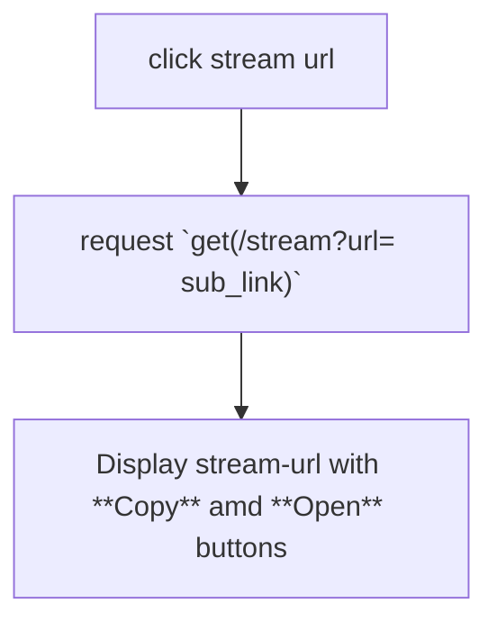

# For server:
## Security
| Flag | Action |
| ---- | ------ |
| `--secure`   | Require  a `--user` (admin username) a `--pass` (admin password)  to start server. Can use `--users` (user.json) to use predefined userlist. Otherwise admin need to log in **(only admin can)** and add users on `/admin?panel=users`. Nobody else can see list or do any action . **However this will allow anyone to download files with direct link.**    <u>**Server Side Process :**</u>   Verify users will be used before every request, will be ignored on file download.  This function will check Header **cookie**. *If not found will sent to log in page.* |
| `--force` | Can be used with `--secure`. **Direct link downloading will not apply here.** So only logged in browser can download file. However this won't apply for "stream-url"|
| `--sforce` | Short hand of using `--secure` and `--force` together. |

------

## stream-url:
Users can create stream-url . This will **allow nonblocking access to the file** and file only. So, anyone with force flag need to use stream-url to download file with IDM or stream .mkv file on VLC . 

**Format:** `/stream?id=(5alphanumerical)` [60M links]

| Flag | Action |
| ---- | ------ |
| `--streamExp` (time in min) | Set stream-url expire time. **DEFAULT = 0**.   If not **0**, will run a thread and each minute, will check if anyone ready to die.|

### stream-url Expire Mechanism:
Use queue when the thread starts it will call get. If empty, will ask again after a minute. If something comes in hand, it'll wait till it's deadline comes. Saves CPU. After sleep, will kill it's first url , then call for next in queue.  If it's ready to die ( 1 links need to die in the same minute), it's killed and keep calling next until somethng comes up that shouldn't be killed then or list empty. Again when empty keeps checking each minutes.

#### On making stream url
When a stream url is made it will be registered in a url dict and in the deadline queue (if deadline is set)

#### in JS :

------

## Reload Feature
Reload allows re-eunning the Python server from remote. But since its  vulnerable, I will be only allowed if `--debug` flag or `debug` in `config dictionary` is enabled.

## File upload
Since file uploading is the most dangerous portion of file serving (server may not use antivirus), any unauthorized action may cause disaster. So each time **when uploading user need to enter Password**
